# NEXUS 
#### *Stay Connected, Stay in Control* 

## INTRODUCTION
The **Smart School System** is an innovative solution that combines hardware and software components to create a seamless experience for students, parents, and teachers.  

#### **Key Features**:  
- **NFC Bracelets with GPS**: Students wear NFC-enabled bracelets for real-time location tracking, ensuring safety and security.  
- **Cashless Payments**: Parents can link credit cards to the NFC bracelets, enabling secure and convenient payments for snacks and meals.  
- **Allergy Alerts**: Parents can input allergy information, and the system automatically declines payments for snacks containing allergens, ensuring student safety.  
- **Teacher Tools**: Teachers can take attendance, post grades, and share notes with parents through a dedicated mobile app, enhancing communication and collaboration.  
- **Canteen Worker Section**: Simplifies snack sales and ensures compliance with allergy restrictions.  

#### **Technologies Used**:  
- **Hardware**: ESP32 microcontroller, NFC chips, GPS modules, and NFC readers.  
- **Software**: Mobile applications for parents, teachers, and canteen workers.  
- **Cloud Integration**: Cloud Firestore for secure, real-time data storage and synchronization.  

#### **Impact**:  
The Smart School System revolutionizes school management by improving student safety, streamlining administrative tasks, and fostering better communication between teachers and parents. It provides a smarter, safer, and more efficient educational environment for all stakeholders.  

## 📱 App Walkthrough
### Parents UI
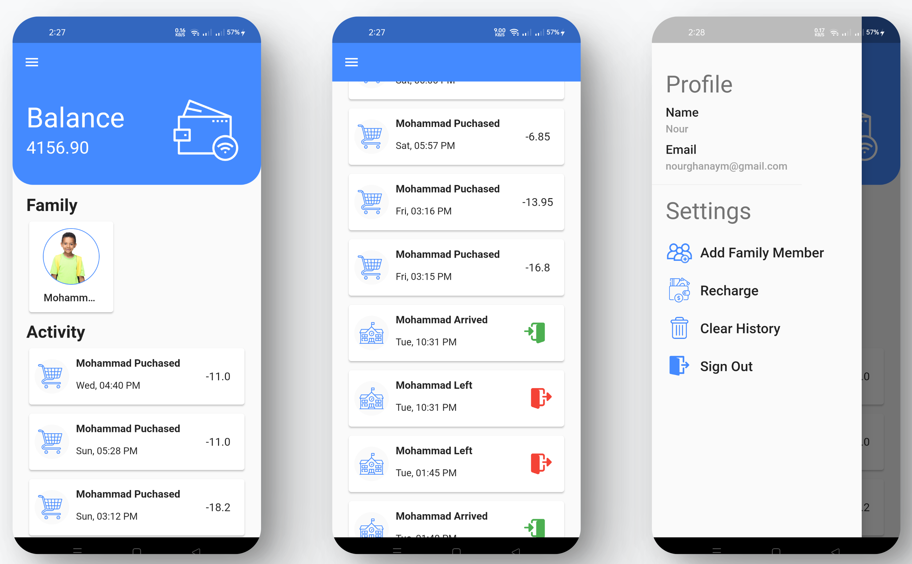
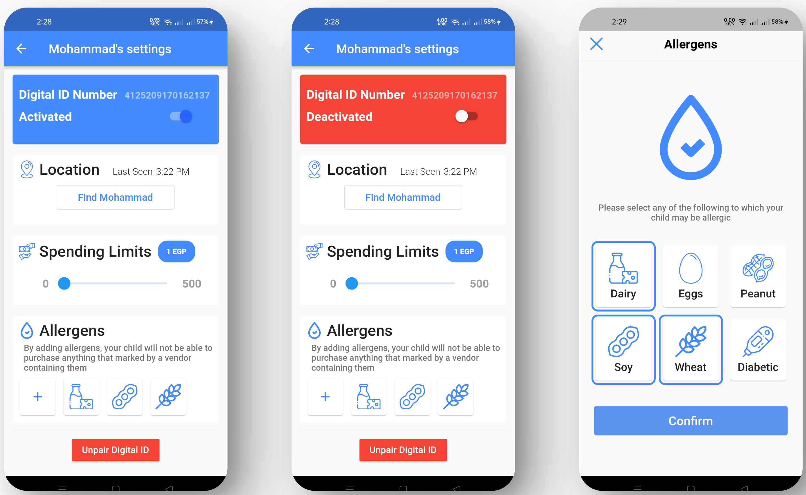

### Teachers UI
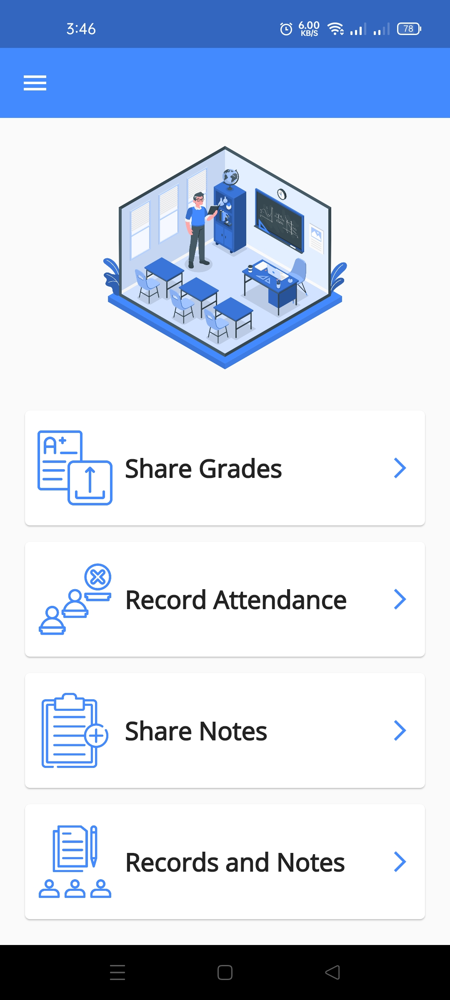
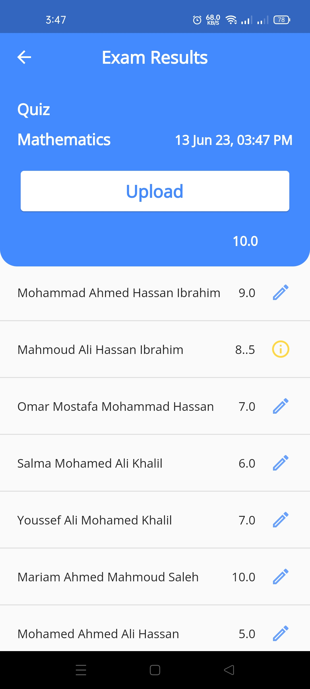
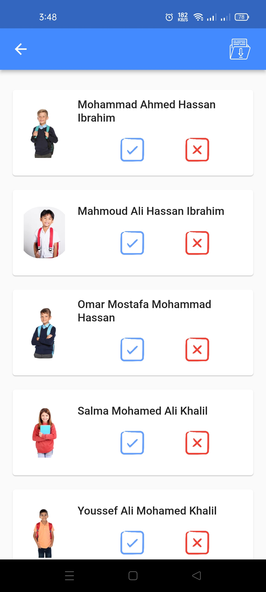
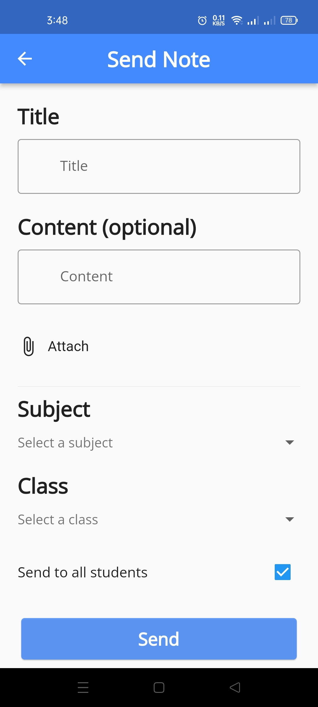
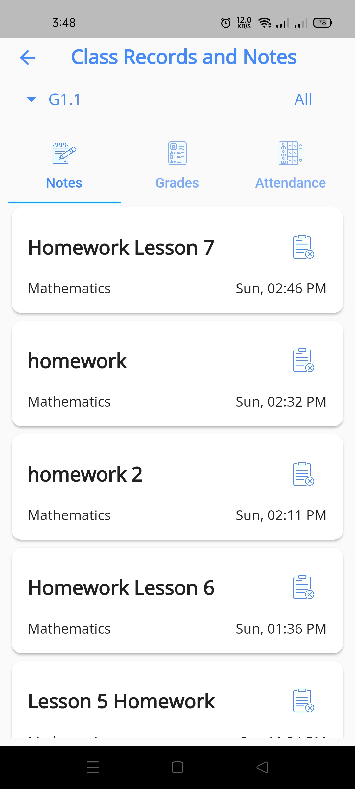
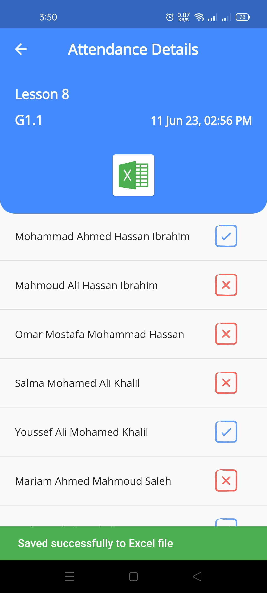

### Canteen Workers UI
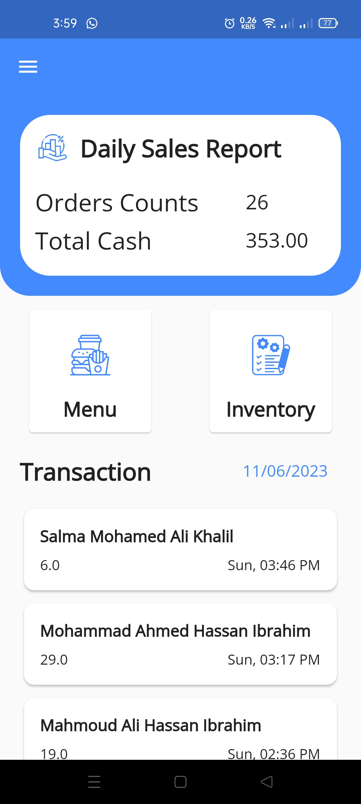
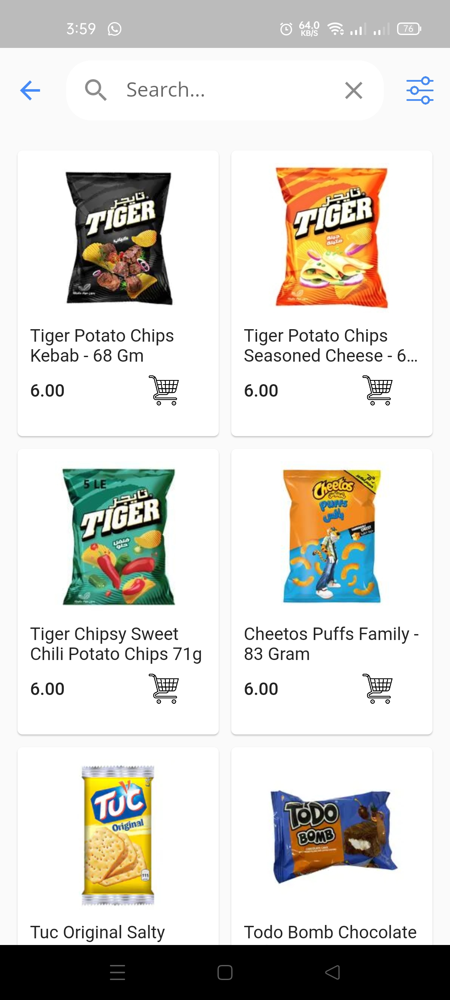
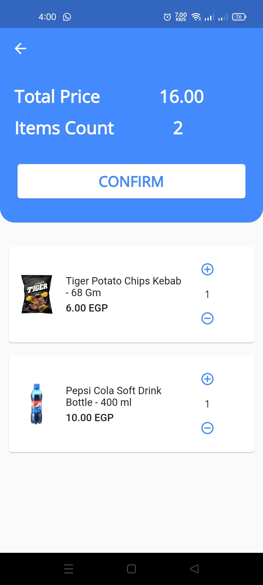
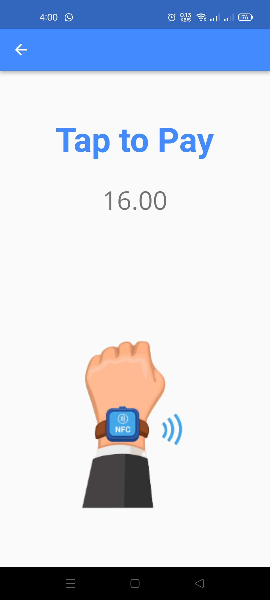
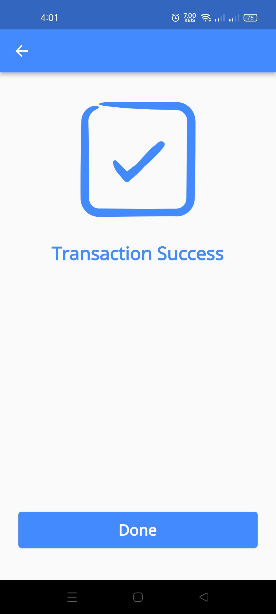
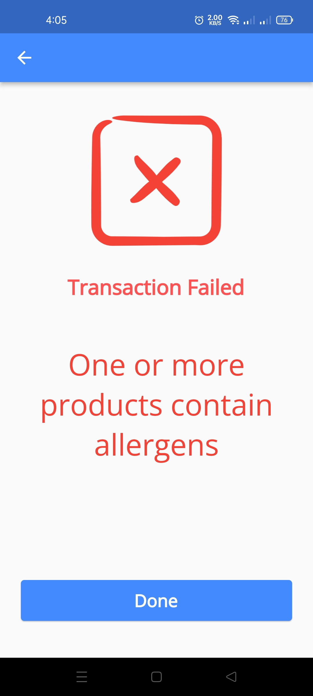

---

## 🚀 Future Work  
1. **Publishing School News**:  
   - Parents will receive updates on school events, occasions, and celebrations directly through the mobile app.  

2. **School Fees Payment**:  
   - Parents will be able to pay school fees, tuition, and purchase uniforms/books through the app, with options for installment payments.  

3. **Student Role**:  
   - A dedicated student role will be added, enabling students to submit homework, attend online quizzes, and interact with the app.  

4. **Bracelet with AI Language Detection**:  
   - The student bracelet will include an AI component to detect and alert against the use of inappropriate language.  

5. **Student Ranking**:  
   - Parents will be able to view their child’s academic ranking within their class and across other classes.  

6. **Canteen Product Database**:  
   - A comprehensive database of canteen products, reviewed by nutrition specialists, will be added to ensure allergy-safe and healthy options.  

7. **Apply Leave Feature**:  
   - Parents will be able to submit leave requests for their child through the app, specifying the reason and time of departure.  

---

## 🎓 Conclusion  
The **Smart School System** addresses the limitations of traditional schools by creating a seamless connection between parents, students, and teachers. Through NFC bracelets with GPS tracking and a dedicated mobile app, the system ensures:  
- **Student Safety**: Real-time location tracking and allergy-aware canteen transactions.  
- **Parental Control**: Monitoring of child’s location, spending limits, and calorie intake.  
- **Teacher Efficiency**: Streamlined attendance tracking, grade sharing, and communication with parents.  

This innovative system enhances the educational experience by leveraging technology to improve safety, communication, and efficiency for all stakeholders.  
